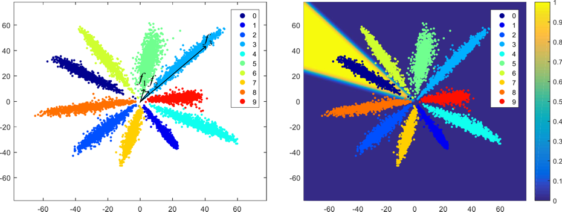
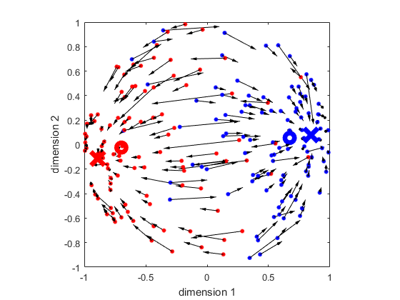

# Matlab codes for drawing figures.

**Requirement**: Caffe with Matlab wrapper: https://github.com/happynear/caffe-windows/tree/ms/matlab . Don't forget to add `caffe_root/matlab` to your Matlab's PATH.

- update_two_point:  Run `test_geodesic_gradient.m` to visualize how two points on a unit circle are optimized to get together via Euclidean Loss.

- figure 2: Run `get_feature.m` to create Figure 2 of the paper. 

- figure 6: Run `create_figure3.m` to create Figure 6 of the paper. Note that this figure is drew on a 3d sphere. You can rotate the figure in Matlab.

