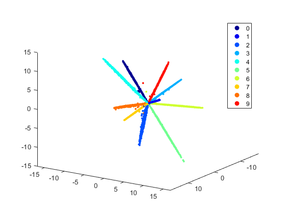

# Example for MNIST Dataset

1. Run `run_mnist.bat` to train the model with C-contrastive loss. You can also modify the `lenet_train_test.prototxt` to use other loss functions.

2. Run `get_feature.m` to get the scatters from the training set.

With simple datasets like MNIST, it is very easy to let the classes away from each other. The distances between classes are easy to be larger than the margin, so the inter-class term of C-contrastive loss will provide little gradient. The model is then guided almost only by the intra-class term. The intra-class variances will keep shrink. This makes the feature scatter look like the one in [1], which can also create very thin distributions. Note that there is no normalization term in [1], we think it is a good idea to combine the large margin strategy and normalization together.

[1] Liu W, Wen Y, Yu Z, et al. Large-Margin Softmax Loss for Convolutional Neural Networks[C]//Proceedings of The 33rd International Conference on Machine Learning. 2016: 507-516.
